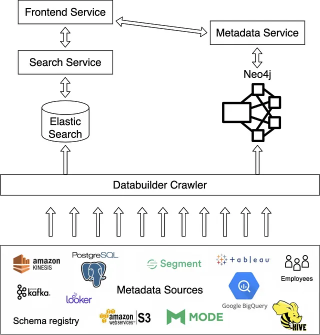

# Amundsen

Amundsen Data Catalog


### Pre req

* Python >= 3.8.x
* elasticsearch 7.x

### Run

#### Environment 

```sh
NEO4J_ENDPOINT=bolt://localhost:7687
CREDENTIALS_NEO4J_USER=neo4j
CREDENTIALS_NEO4J_PASSWORD=mypassword
ELASTICHSEARCH_HOST=localhost
ELASTICHSEARCH_PORT=9200
GOOGLE_APPLICATION_CREDENTIALS=./credentials/service_account.json
```

#### Docker run

```sh
docker compose  -f server/docker-compose-amundsen.yaml up
```

#### Elastic Search

(Method 1) Add /etc/sysctl.conf

> vm.max_map_count=262144


(Method 2) Ephemeral

```sh
sysctl -w vm.max_map_count=262144
```
### Web UI

* [Amundsen Web](http://localhost:5000/)
* [Neo4J](http://localhost:7474/) user: neo4j pwd: mypassword
* [Elastic Search](http://localhost:9200/)

### API

```
curl -v http://localhost:5002/healthcheck
```

> Neo4j Bolt
> - bolt://localhost:7687/ 
> - user: neo4j pwd: mypassword

### Architecture



## References

- https://medium.com/talabat-tech/a-step-by-step-guide-deploying-amundsen-on-google-cloud-platform-ee4ef20d81f5
- https://gobblin.apache.org/docs/
- https://www.amundsen.io/amundsen/databuilder/
- https://www.elastic.co/guide/en/elasticsearch/reference/current/docker.html#docker-cli-run-prod-mode
- https://discuss.elastic.co/t/create-user-in-elasticsearch/182401/2
- https://www.amundsen.io/amundsen/databuilder/docs/dashboard_ingestion_guide/
- https://www.amundsen.io/amundsen/installation/#troubleshooting
